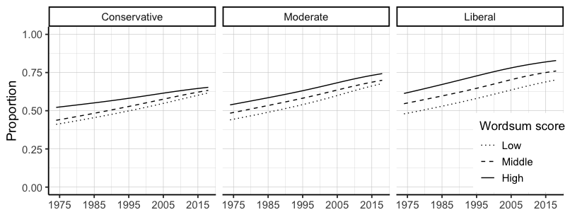
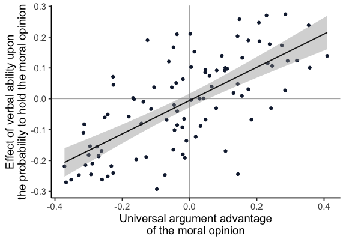
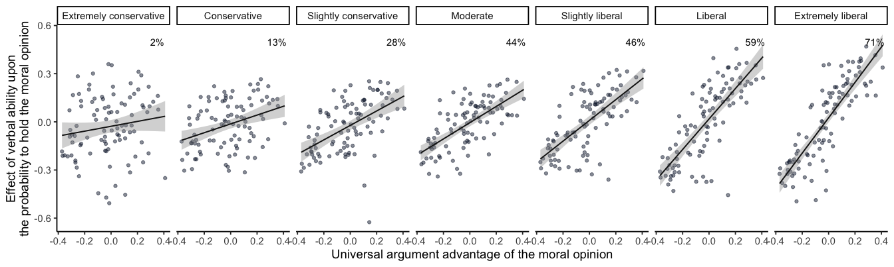

## Method

### Self-reported ideology


polviews             n   percent
-------------  -------  --------
conservative    381855        34
moderate        429141        38
liberal         316650        28

### Verbal ability


wordsum_gr         n   percent
-----------  -------  --------
Low           453456        39
Middle        446518        38
High          276567        24


### Effects of verbal ability on moral opinions

Verbal ability effects range.


   estimate  issue     question                                                                                                                                                                                                    
-----------  --------  ------------------------------------------------------------------------------------------------------------------------------------------------------------------------------------------------------------
  0.2744736  spkhomo   Consider a man who admits that he is a homosexual? Suppose this admitted homosexual wanted to make a speech in your community. Should he be allowed to speak?                                               
 -0.2926743  obeylaw   In general - would you say that people should obey the law without exception rather than there are exceptional occasions on which people should follow their consciences even if it means breaking the law? 

Confidence intervals range.


 min(ci_width)   max(ci_width)
--------------  --------------
     0.0315992       0.1891597

### Universal arguments advantage (UAA) measures.

The UAA measures range.


```
## # A tibble: 2 x 3
##   hfvl_advantage issue   question                                          
##            <dbl> <chr>   <chr>                                             
## 1         -0.372 fehome  Women should take care of running their homes and…
## 2          0.410 marhomo Homosexual couples should have the right to marry…
```


## Results 

### Hypothesis 1



### Hypothesis 2

Correlation between the verbal ability effect and UAA.

```
## [1] "*r* (95) = 0.69, 95% CI [0.57, 0.78], p < 0.001. R squared = 0.48"
```

A linear regression effect after recoding.


```
## [1] "$\\beta$ = 0.48, 95% CI [0.28, 0.68], t(95) = 4.8, p < 0.001. R squared 0.19"
```




### Hypothesis 3




### Interaction table

<table>
<caption>Table 1. Linear regressions examining how the effect of verbal ability on moral opinions with universal argument advantage varied with the size of the advantage, the ideology of the segment, and  their interaction.</caption>
 <thead>
  <tr>
   <th style="text-align:left;">  </th>
   <th style="text-align:left;">  </th>
  </tr>
 </thead>
<tbody>
  <tr>
   <td style="text-align:left;"> (Intercept) </td>
   <td style="text-align:left;"> -0.00 [-0.01, 0.01] </td>
  </tr>
  <tr>
   <td style="text-align:left;"> UAA </td>
   <td style="text-align:left;"> 0.58 [0.53, 0.64] </td>
  </tr>
  <tr>
   <td style="text-align:left;"> Ideology </td>
   <td style="text-align:left;"> 0.01 [0.00, 0.01] </td>
  </tr>
  <tr>
   <td style="text-align:left;"> UAA x Ideology </td>
   <td style="text-align:left;"> 0.16 [0.13, 0.19] </td>
  </tr>
</tbody>
</table>
Note: 97 issues, N = 679. The ideology scale is coded from -3 (extremely conservative) to 3 (extremely liberal). Adjusted R2 = 0.43. 


## Supplementary table 1. 

The 97 GSS items with estimated effect of verbal ability in log odds with 95% CI and universal argument advantage (UAA). 

<table>
<caption>Table S1.The 97 GSS items with estimated effect of verbal ability in log odds with 95% CI and universal argument advantage (UAA), sorted by absolute value of UAA.</caption>
 <thead>
  <tr>
   <th style="text-align:left;"> Question </th>
   <th style="text-align:left;"> Verb.ab. effect </th>
   <th style="text-align:right;"> UAA </th>
  </tr>
 </thead>
<tbody>
  <tr>
   <td style="text-align:left;"> Homosexual couples should have the right to marry one another. </td>
   <td style="text-align:left;"> 0.14 [0.10, 0.18] </td>
   <td style="text-align:right;"> 0.41 </td>
  </tr>
  <tr>
   <td style="text-align:left;"> Women should take care of running their homes and leave running the country up to men. </td>
   <td style="text-align:left;"> -0.22 [-0.24, -0.19] </td>
   <td style="text-align:right;"> -0.37 </td>
  </tr>
  <tr>
   <td style="text-align:left;"> Do you think there should be laws against marriages between African-Americans and whites? </td>
   <td style="text-align:left;"> -0.27 [-0.31, -0.24] </td>
   <td style="text-align:right;"> -0.37 </td>
  </tr>
  <tr>
   <td style="text-align:left;"> Would you be in favor of having a close relative or family member marry a black person? </td>
   <td style="text-align:left;"> 0.10 [0.07, 0.14] </td>
   <td style="text-align:right;"> 0.36 </td>
  </tr>
  <tr>
   <td style="text-align:left;"> Consider a man who admits that he is a homosexual. Should such a person be allowed to teach in a college or university? </td>
   <td style="text-align:left;"> 0.24 [0.22, 0.26] </td>
   <td style="text-align:right;"> 0.35 </td>
  </tr>
  <tr>
   <td style="text-align:left;"> Would you approve of a man punching a stranger who was in a protest march showing opposition to the other man's views? </td>
   <td style="text-align:left;"> -0.26 [-0.33, -0.19] </td>
   <td style="text-align:right;"> -0.35 </td>
  </tr>
  <tr>
   <td style="text-align:left;"> Consider a man who admits that he is a homosexual. If some people in your community suggested that a book he wrote in favor of homosexuality should be taken out of your public library -- would you favor removing this book? </td>
   <td style="text-align:left;"> -0.25 [-0.27, -0.23] </td>
   <td style="text-align:right;"> -0.33 </td>
  </tr>
  <tr>
   <td style="text-align:left;"> Would you be in favor of having a close relative or family member marry an Asian American person? </td>
   <td style="text-align:left;"> 0.12 [0.08, 0.17] </td>
   <td style="text-align:right;"> 0.32 </td>
  </tr>
  <tr>
   <td style="text-align:left;"> It is much better for everyone involved if the man is the achiever outside the home and the woman takes care of the home and family. </td>
   <td style="text-align:left;"> -0.11 [-0.13, -0.09] </td>
   <td style="text-align:right;"> -0.32 </td>
  </tr>
  <tr>
   <td style="text-align:left;"> Those who violate God's rules must be punished. </td>
   <td style="text-align:left;"> -0.08 [-0.12, -0.05] </td>
   <td style="text-align:right;"> -0.31 </td>
  </tr>
  <tr>
   <td style="text-align:left;"> A man's job is to earn money - a woman's job is to look after the home and family. </td>
   <td style="text-align:left;"> -0.21 [-0.29, -0.14] </td>
   <td style="text-align:right;"> -0.31 </td>
  </tr>
  <tr>
   <td style="text-align:left;"> Consider a man who admits he is a Communist. Suppose he is teaching in a college. Should he be fired? </td>
   <td style="text-align:left;"> -0.18 [-0.20, -0.16] </td>
   <td style="text-align:right;"> -0.30 </td>
  </tr>
  <tr>
   <td style="text-align:left;"> Would you approve of a policeman striking a citizen who had said vulgar and obscene things to the policeman? </td>
   <td style="text-align:left;"> -0.15 [-0.18, -0.13] </td>
   <td style="text-align:right;"> -0.30 </td>
  </tr>
  <tr>
   <td style="text-align:left;"> Would you approve of a policeman striking a citizen who was being questioned as a suspect in a murder case? </td>
   <td style="text-align:left;"> -0.24 [-0.27, -0.22] </td>
   <td style="text-align:right;"> -0.29 </td>
  </tr>
  <tr>
   <td style="text-align:left;"> Would you be in favor of having a close relative or family member marry a Hispanic American person? </td>
   <td style="text-align:left;"> 0.12 [0.08, 0.16] </td>
   <td style="text-align:right;"> 0.29 </td>
  </tr>
  <tr>
   <td style="text-align:left;"> What about sexual relations between two adults of the same sex--do you think it is always wrong? </td>
   <td style="text-align:left;"> -0.21 [-0.23, -0.19] </td>
   <td style="text-align:right;"> -0.29 </td>
  </tr>
  <tr>
   <td style="text-align:left;"> Consider a man who admits that he is a homosexual? Suppose this admitted homosexual wanted to make a speech in your community. Should he be allowed to speak? </td>
   <td style="text-align:left;"> 0.27 [0.25, 0.30] </td>
   <td style="text-align:right;"> 0.29 </td>
  </tr>
  <tr>
   <td style="text-align:left;"> Do you agree that methods of birth control should be available to teenagers between the ages of 14 and 16 if their parents do not approve? </td>
   <td style="text-align:left;"> 0.03 [0.01, 0.05] </td>
   <td style="text-align:right;"> 0.28 </td>
  </tr>
  <tr>
   <td style="text-align:left;"> It is more important for a wife to help her husband's career than to have one herself. </td>
   <td style="text-align:left;"> -0.15 [-0.19, -0.12] </td>
   <td style="text-align:right;"> -0.28 </td>
  </tr>
  <tr>
   <td style="text-align:left;"> Do you approve of a married woman earning money in business or industry if she has a husband capable of supporting her? </td>
   <td style="text-align:left;"> 0.17 [0.15, 0.20] </td>
   <td style="text-align:right;"> 0.27 </td>
  </tr>
  <tr>
   <td style="text-align:left;"> White people have a right to keep African-Americans out of their neighborhoods if they want to and African-Americans should respect that right. </td>
   <td style="text-align:left;"> -0.18 [-0.21, -0.16] </td>
   <td style="text-align:right;"> -0.27 </td>
  </tr>
  <tr>
   <td style="text-align:left;"> People should support their country even if the country is in the wrong. </td>
   <td style="text-align:left;"> -0.19 [-0.26, -0.12] </td>
   <td style="text-align:right;"> -0.27 </td>
  </tr>
  <tr>
   <td style="text-align:left;"> African-Americans shouldn't push themselves where they're not wanted. </td>
   <td style="text-align:left;"> -0.17 [-0.20, -0.14] </td>
   <td style="text-align:right;"> -0.26 </td>
  </tr>
  <tr>
   <td style="text-align:left;"> Consider a man who admits he is a Communist.  Suppose he wrote a book which is in your public library. Somebody in your community suggests that the book should be removed from the library. Would you favor removing it? </td>
   <td style="text-align:left;"> -0.26 [-0.28, -0.24] </td>
   <td style="text-align:right;"> -0.26 </td>
  </tr>
  <tr>
   <td style="text-align:left;"> Do you agree that it is sometimes necessary to discipline a child with a good hard spanking? </td>
   <td style="text-align:left;"> -0.06 [-0.08, -0.04] </td>
   <td style="text-align:right;"> -0.25 </td>
  </tr>
  <tr>
   <td style="text-align:left;"> If you and your friends belonged to a social club that would not let African-Americans join -- would you try to change the rules so that African-Americans could join? </td>
   <td style="text-align:left;"> 0.11 [0.07, 0.14] </td>
   <td style="text-align:right;"> 0.25 </td>
  </tr>
  <tr>
   <td style="text-align:left;"> American television should give preference to American films and programs. </td>
   <td style="text-align:left;"> -0.25 [-0.33, -0.17] </td>
   <td style="text-align:right;"> -0.24 </td>
  </tr>
  <tr>
   <td style="text-align:left;"> There's been a lot of discussion about the way morals and attitudes about sex are changing in this country. If a man and woman have sex relations before marriage -- do you think it is wrong? </td>
   <td style="text-align:left;"> -0.05 [-0.07, -0.03] </td>
   <td style="text-align:right;"> -0.24 </td>
  </tr>
  <tr>
   <td style="text-align:left;"> In general some people think that it is the responsibility of the government in Washington to see to it that people have help in paying for doctors and hospital bills. Others think that these matters are not the responsibility of the federal government and that people should take care of these things themselves. Do you think that it is the responsibility of the government? </td>
   <td style="text-align:left;"> -0.03 [-0.06, -0.00] </td>
   <td style="text-align:right;"> 0.24 </td>
  </tr>
  <tr>
   <td style="text-align:left;"> There are always some people whose ideas are considered bad or dangerous by other people. For instance: somebody who is against all churches and religion -- should such a person be allowed to teach in a college or university? </td>
   <td style="text-align:left;"> 0.18 [0.16, 0.20] </td>
   <td style="text-align:right;"> 0.24 </td>
  </tr>
  <tr>
   <td style="text-align:left;"> Consider a person who advocates doing away with elections and letting the military run the country. Suppose he wrote a book advocating doing away with elections and letting the military run the country. Somebody in your community suggests that the book be removed from the public library. Would you favor removing it? </td>
   <td style="text-align:left;"> -0.22 [-0.24, -0.20] </td>
   <td style="text-align:right;"> -0.23 </td>
  </tr>
  <tr>
   <td style="text-align:left;"> Do you think the use of marijuana should be made legal? </td>
   <td style="text-align:left;"> 0.11 [0.09, 0.14] </td>
   <td style="text-align:right;"> 0.23 </td>
  </tr>
  <tr>
   <td style="text-align:left;"> Consider a man who admits he is a Communist. Suppose this admitted Communist wanted to make a speech in your community. Should he be allowed to speak? </td>
   <td style="text-align:left;"> 0.27 [0.25, 0.29] </td>
   <td style="text-align:right;"> 0.23 </td>
  </tr>
  <tr>
   <td style="text-align:left;"> People who want children ought to get married. </td>
   <td style="text-align:left;"> 0.07 [0.01, 0.13] </td>
   <td style="text-align:right;"> -0.23 </td>
  </tr>
  <tr>
   <td style="text-align:left;"> There are always some people whose ideas are considered bad or dangerous by other people. For instance somebody who is against all churches and religion. If some people in your community suggested that a book he wrote against churches and religion should be taken out of your public library -- would you favor removing this book? </td>
   <td style="text-align:left;"> -0.24 [-0.26, -0.22] </td>
   <td style="text-align:right;"> -0.23 </td>
  </tr>
  <tr>
   <td style="text-align:left;"> Would you approve of a policeman striking a citizen who was attempting to escape from custody? </td>
   <td style="text-align:left;"> 0.05 [0.02, 0.07] </td>
   <td style="text-align:right;"> -0.23 </td>
  </tr>
  <tr>
   <td style="text-align:left;"> Would you be in favor of having a close relative or family member marry a white person? </td>
   <td style="text-align:left;"> 0.19 [0.12, 0.26] </td>
   <td style="text-align:right;"> 0.21 </td>
  </tr>
  <tr>
   <td style="text-align:left;"> Consider somebody who is against all churches and religion. If such a person wanted to make a speech in your (city/town/community) against churches and religion -- should he be allowed to speak? </td>
   <td style="text-align:left;"> 0.25 [0.23, 0.27] </td>
   <td style="text-align:right;"> 0.21 </td>
  </tr>
  <tr>
   <td style="text-align:left;"> Some people think that the government in Washington should do everything possible to improve the standard of living of all poor Americans. Other people think it is not the government's responsibility and that each person should take care of himself. Do you think that the government should do everything possible to improve the standard of living of all poor Americans? </td>
   <td style="text-align:left;"> -0.07 [-0.10, -0.04] </td>
   <td style="text-align:right;"> 0.18 </td>
  </tr>
  <tr>
   <td style="text-align:left;"> Foreigners should not be allowed to buy land in America. </td>
   <td style="text-align:left;"> -0.06 [-0.13, 0.01] </td>
   <td style="text-align:right;"> -0.18 </td>
  </tr>
  <tr>
   <td style="text-align:left;"> When a person has a disease that cannot be cured -- do you think doctors should be allowed by law to end the patient's life by some painless means if the patient and his family request it? </td>
   <td style="text-align:left;"> 0.03 [0.01, 0.05] </td>
   <td style="text-align:right;"> 0.17 </td>
  </tr>
  <tr>
   <td style="text-align:left;"> Consider a person who advocates doing away with elections and letting the military run the country. If such a person wanted to make a speech in your community -- should he be allowed to speak? </td>
   <td style="text-align:left;"> 0.19 [0.17, 0.21] </td>
   <td style="text-align:right;"> 0.17 </td>
  </tr>
  <tr>
   <td style="text-align:left;"> Consider people who are in their early teens -- say 14 to 16 years old. In that case: do you think sex relations before marriage are wrong? </td>
   <td style="text-align:left;"> 0.00 [-0.02, 0.03] </td>
   <td style="text-align:right;"> -0.17 </td>
  </tr>
  <tr>
   <td style="text-align:left;"> Consider your feelings about pornography laws. Do you think it should be illegal? </td>
   <td style="text-align:left;"> -0.00 [-0.04, 0.04] </td>
   <td style="text-align:right;"> -0.16 </td>
  </tr>
  <tr>
   <td style="text-align:left;"> Would you approve of a man punching a stranger who was drunk and bumped into the man and his wife on the street? </td>
   <td style="text-align:left;"> -0.20 [-0.24, -0.15] </td>
   <td style="text-align:right;"> -0.16 </td>
  </tr>
  <tr>
   <td style="text-align:left;"> Consider a person who advocates doing away with elections and letting the military run the country. Should such a person be allowed to teach in a college or university? </td>
   <td style="text-align:left;"> 0.13 [0.11, 0.15] </td>
   <td style="text-align:right;"> 0.16 </td>
  </tr>
  <tr>
   <td style="text-align:left;"> Do you think it should be possible for a pregnant woman to obtain a legal abortion if the woman's own health is seriously endangered by the pregnancy? </td>
   <td style="text-align:left;"> 0.01 [-0.02, 0.04] </td>
   <td style="text-align:right;"> 0.16 </td>
  </tr>
  <tr>
   <td style="text-align:left;"> Now consider a Muslim clergyman who preaches hatred of the United States. If such a person wanted to make a speech in your community preaching hatred of the United States - should he be allowed to speak? </td>
   <td style="text-align:left;"> 0.26 [0.22, 0.30] </td>
   <td style="text-align:right;"> 0.15 </td>
  </tr>
  <tr>
   <td style="text-align:left;"> Ethnic minorities should be given government assistance to preserve their customs and traditions. </td>
   <td style="text-align:left;"> -0.24 [-0.34, -0.15] </td>
   <td style="text-align:right;"> 0.14 </td>
  </tr>
  <tr>
   <td style="text-align:left;"> Do you think it should be possible for a pregnant woman to obtain a legal abortion if she became pregnant as a result of rape? </td>
   <td style="text-align:left;"> 0.05 [0.03, 0.07] </td>
   <td style="text-align:right;"> 0.14 </td>
  </tr>
  <tr>
   <td style="text-align:left;"> Do you favor the death penalty for persons convicted of murder? </td>
   <td style="text-align:left;"> -0.08 [-0.10, -0.06] </td>
   <td style="text-align:right;"> -0.14 </td>
  </tr>
  <tr>
   <td style="text-align:left;"> Now consider a Muslim clergyman who preaches hatred of the United States. Should such a person be allowed to teach in a college or university? </td>
   <td style="text-align:left;"> 0.20 [0.16, 0.25] </td>
   <td style="text-align:right;"> 0.14 </td>
  </tr>
  <tr>
   <td style="text-align:left;"> Those in need have to learn to take care of themselves and not depend on others. </td>
   <td style="text-align:left;"> -0.01 [-0.09, 0.07] </td>
   <td style="text-align:right;"> -0.14 </td>
  </tr>
  <tr>
   <td style="text-align:left;"> Some people think that African-Americans have been discriminated against for so long that the government has a special obligation to help improve their living standards. Others believe that the government should not be giving special treatment to African-Americans. Do you think that the government should help improve the living standards of African-Americans? </td>
   <td style="text-align:left;"> 0.02 [-0.01, 0.05] </td>
   <td style="text-align:right;"> 0.13 </td>
  </tr>
  <tr>
   <td style="text-align:left;"> America should follow its own interests - even if this leads to conflicts with other nations. </td>
   <td style="text-align:left;"> -0.19 [-0.26, -0.11] </td>
   <td style="text-align:right;"> -0.13 </td>
  </tr>
  <tr>
   <td style="text-align:left;"> Are there any situations you can imagine in which you would approve of a policeman striking an adult male citizen? </td>
   <td style="text-align:left;"> 0.19 [0.17, 0.21] </td>
   <td style="text-align:right;"> -0.12 </td>
  </tr>
  <tr>
   <td style="text-align:left;"> Suppose there is a community-wide vote on the general housing issue. There are two possible laws to vote on (OWNER DECIDES and CAN'T DISCRIMINATE). Would you vote for owner decides? </td>
   <td style="text-align:left;"> -0.03 [-0.06, -0.01] </td>
   <td style="text-align:right;"> -0.11 </td>
  </tr>
  <tr>
   <td style="text-align:left;"> Do you think a person has the right to end his or her own life if this person has an incurable disease? </td>
   <td style="text-align:left;"> 0.10 [0.08, 0.11] </td>
   <td style="text-align:right;"> 0.11 </td>
  </tr>
  <tr>
   <td style="text-align:left;"> Both the husband and the wife should contribute to the household income. </td>
   <td style="text-align:left;"> -0.17 [-0.26, -0.08] </td>
   <td style="text-align:right;"> 0.11 </td>
  </tr>
  <tr>
   <td style="text-align:left;"> Would you be for sex education in the public schools? </td>
   <td style="text-align:left;"> 0.10 [0.08, 0.13] </td>
   <td style="text-align:right;"> 0.11 </td>
  </tr>
  <tr>
   <td style="text-align:left;"> Everything considered: would you say that -- in general -- you approve of wiretapping? </td>
   <td style="text-align:left;"> 0.04 [0.01, 0.07] </td>
   <td style="text-align:right;"> -0.11 </td>
  </tr>
  <tr>
   <td style="text-align:left;"> Would you approve of a man punching a stranger who was beating up a woman and the man saw it? </td>
   <td style="text-align:left;"> 0.09 [0.06, 0.13] </td>
   <td style="text-align:right;"> 0.11 </td>
  </tr>
  <tr>
   <td style="text-align:left;"> In general - would you say that people should obey the law without exception rather than there are exceptional occasions on which people should follow their consciences even if it means breaking the law? </td>
   <td style="text-align:left;"> -0.29 [-0.34, -0.24] </td>
   <td style="text-align:right;"> -0.10 </td>
  </tr>
  <tr>
   <td style="text-align:left;"> Do you think a person has the right to end his or her own life if this person is tired of living and ready to die? </td>
   <td style="text-align:left;"> 0.14 [0.12, 0.16] </td>
   <td style="text-align:right;"> 0.10 </td>
  </tr>
  <tr>
   <td style="text-align:left;"> Do you think it should be possible for a pregnant woman to obtain a legal abortion if she is not married and does not want to marry the man? </td>
   <td style="text-align:left;"> 0.09 [0.07, 0.11] </td>
   <td style="text-align:right;"> 0.08 </td>
  </tr>
  <tr>
   <td style="text-align:left;"> Government should let ordinary people decide for themselves how to protect the environment - even if it means they don't always dothe right thing - rather than passing laws to make ordinary people protect the environment as it interferes with people's right to make their own decisions. </td>
   <td style="text-align:left;"> -0.03 [-0.07, 0.01] </td>
   <td style="text-align:right;"> 0.08 </td>
  </tr>
  <tr>
   <td style="text-align:left;"> Would you yourself have any objection to sending your children to a school where a few of the children are African-Americans? </td>
   <td style="text-align:left;"> -0.25 [-0.30, -0.19] </td>
   <td style="text-align:right;"> -0.07 </td>
  </tr>
  <tr>
   <td style="text-align:left;"> What is your opinion about a married person having sexual relations with someone other than the marriage partner--is it wrong? </td>
   <td style="text-align:left;"> -0.07 [-0.10, -0.04] </td>
   <td style="text-align:right;"> -0.07 </td>
  </tr>
  <tr>
   <td style="text-align:left;"> Even if it brings no immediate benefits - scientific research that advances the frontiers of knowledge is necessary and should be supported by the federal government. </td>
   <td style="text-align:left;"> 0.04 [-0.01, 0.09] </td>
   <td style="text-align:right;"> 0.07 </td>
  </tr>
  <tr>
   <td style="text-align:left;"> Would you approve of a policeman striking a citizen who was attacking the policeman with his fists? </td>
   <td style="text-align:left;"> 0.12 [0.09, 0.15] </td>
   <td style="text-align:right;"> -0.06 </td>
  </tr>
  <tr>
   <td style="text-align:left;"> Do you think it should be possible for a pregnant woman to obtain a legal abortion if the family has a very low income and cannot afford any more children? </td>
   <td style="text-align:left;"> 0.07 [0.06, 0.09] </td>
   <td style="text-align:right;"> 0.06 </td>
  </tr>
  <tr>
   <td style="text-align:left;"> Would you favor a law which would require a person to obtain a police permit before he or she could buy a gun? </td>
   <td style="text-align:left;"> 0.04 [0.02, 0.06] </td>
   <td style="text-align:right;"> -0.05 </td>
  </tr>
  <tr>
   <td style="text-align:left;"> Consider a person who believes that Blacks are genetically inferior. If some people in your community suggested that a book he wrote which said Blacks are inferior should be taken out of your public library -- would you favor removing this book? </td>
   <td style="text-align:left;"> -0.16 [-0.18, -0.15] </td>
   <td style="text-align:right;"> -0.05 </td>
  </tr>
  <tr>
   <td style="text-align:left;"> In general: do you favor the busing of African-American and white school children from one school district to another? </td>
   <td style="text-align:left;"> -0.07 [-0.09, -0.04] </td>
   <td style="text-align:right;"> 0.05 </td>
  </tr>
  <tr>
   <td style="text-align:left;"> Are there any situations that you can imagine in which you would approve of a man punching an adult male stranger? </td>
   <td style="text-align:left;"> 0.17 [0.14, 0.19] </td>
   <td style="text-align:right;"> -0.05 </td>
  </tr>
  <tr>
   <td style="text-align:left;"> Do you think it should be possible for a pregnant woman to obtain a legal abortion if she is married and does not want any more children? </td>
   <td style="text-align:left;"> 0.09 [0.08, 0.11] </td>
   <td style="text-align:right;"> 0.05 </td>
  </tr>
  <tr>
   <td style="text-align:left;"> Consider a person who believes that Blacks are genetically inferior. Should such a person be allowed to teach in a college or university? </td>
   <td style="text-align:left;"> 0.09 [0.07, 0.10] </td>
   <td style="text-align:right;"> 0.05 </td>
  </tr>
  <tr>
   <td style="text-align:left;"> Would you yourself have any objection to sending your children to a school where more than half of the children are African-Americans? </td>
   <td style="text-align:left;"> -0.02 [-0.05, 0.01] </td>
   <td style="text-align:right;"> -0.05 </td>
  </tr>
  <tr>
   <td style="text-align:left;"> Do you personally think it is wrong for a woman to have an abortion if the family has a very low income and cannot afford any more children. </td>
   <td style="text-align:left;"> -0.10 [-0.15, -0.05] </td>
   <td style="text-align:right;"> -0.04 </td>
  </tr>
  <tr>
   <td style="text-align:left;"> Religious leaders should not try to influence how people vote in elections. </td>
   <td style="text-align:left;"> 0.00 [-0.07, 0.07] </td>
   <td style="text-align:right;"> 0.04 </td>
  </tr>
  <tr>
   <td style="text-align:left;"> Would you approve of a man punching a stranger who had broken into the man's house? </td>
   <td style="text-align:left;"> 0.05 [0.02, 0.09] </td>
   <td style="text-align:right;"> -0.04 </td>
  </tr>
  <tr>
   <td style="text-align:left;"> Do you think a person has the right to end his or her own life if this person has dishonored his or her family? </td>
   <td style="text-align:left;"> 0.21 [0.18, 0.24] </td>
   <td style="text-align:right;"> -0.04 </td>
  </tr>
  <tr>
   <td style="text-align:left;"> Some people say that because of past discrimination - blacks should be given preference in hiring and promotion. Others say that such preference in hiring and promotion of blacks is wrong because it discriminates against whites. What about your opinion - are you for preferential hiring and promotion of blacks? </td>
   <td style="text-align:left;"> -0.09 [-0.11, -0.06] </td>
   <td style="text-align:right;"> -0.04 </td>
  </tr>
  <tr>
   <td style="text-align:left;"> Do you personally think it is wrongfor a woman to have an abortion if there is a strong chance of serious defect in the baby. </td>
   <td style="text-align:left;"> -0.04 [-0.11, 0.03] </td>
   <td style="text-align:right;"> -0.04 </td>
  </tr>
  <tr>
   <td style="text-align:left;"> On the whole - do you think it should be the government's responsibility to impose strict laws to make industry do less damage to the environment? </td>
   <td style="text-align:left;"> -0.09 [-0.18, 0.01] </td>
   <td style="text-align:right;"> 0.03 </td>
  </tr>
  <tr>
   <td style="text-align:left;"> Do you think it should be possible for a pregnant woman to obtain a legal abortion if there is a strong chance of serious defect in the baby? </td>
   <td style="text-align:left;"> 0.00 [-0.02, 0.02] </td>
   <td style="text-align:right;"> 0.03 </td>
  </tr>
  <tr>
   <td style="text-align:left;"> For certain problems - like environmental pollution - international bodies should have the right to enforce solutions. </td>
   <td style="text-align:left;"> -0.09 [-0.19, 0.00] </td>
   <td style="text-align:right;"> -0.02 </td>
  </tr>
  <tr>
   <td style="text-align:left;"> Irish and Italians and Jewish and many other minorities overcame prejudice and worked their way up. Blacks should do the same without special favors. </td>
   <td style="text-align:left;"> -0.18 [-0.21, -0.15] </td>
   <td style="text-align:right;"> -0.02 </td>
  </tr>
  <tr>
   <td style="text-align:left;"> Would you approve of a man punching a stranger who had hit the man's child after the child accidentally damaged the stranger's car? </td>
   <td style="text-align:left;"> 0.06 [0.04, 0.09] </td>
   <td style="text-align:right;"> -0.02 </td>
  </tr>
  <tr>
   <td style="text-align:left;"> Government should let businesses decide for themselves how to protect the environment - even if it means they don't always do the right thing - rather than passing laws to make businesses protect the environment as it interferes with business' right to make their own decisions. </td>
   <td style="text-align:left;"> -0.12 [-0.18, -0.06] </td>
   <td style="text-align:right;"> 0.02 </td>
  </tr>
  <tr>
   <td style="text-align:left;"> Would you yourself have any objection to sending your children to a school where half of the children are African-Americans? </td>
   <td style="text-align:left;"> -0.07 [-0.09, -0.04] </td>
   <td style="text-align:right;"> -0.02 </td>
  </tr>
  <tr>
   <td style="text-align:left;"> Consider a person who believes that Blacks are genetically inferior. If such a person wanted to make a speech in your community claiming that Blacks are inferior -- should he be allowed to speak? </td>
   <td style="text-align:left;"> 0.15 [0.13, 0.17] </td>
   <td style="text-align:right;"> 0.01 </td>
  </tr>
  <tr>
   <td style="text-align:left;"> Some people say that because of past discrimination women should be given preference in hiring and promotion. Others say that such preference in hiring and promotion of women is wrong because it discriminates against men. What about your opinion - are you for preferential hiring and promotion of women? </td>
   <td style="text-align:left;"> -0.19 [-0.23, -0.16] </td>
   <td style="text-align:right;"> -0.01 </td>
  </tr>
  <tr>
   <td style="text-align:left;"> Because of past discrimination employers should make special efforts to hire and promote qualified women. </td>
   <td style="text-align:left;"> -0.14 [-0.18, -0.10] </td>
   <td style="text-align:right;"> -0.01 </td>
  </tr>
  <tr>
   <td style="text-align:left;"> Do you think it should be possible for a pregnant woman to obtain a legal abortion if the woman wants it for any reason? </td>
   <td style="text-align:left;"> 0.10 [0.08, 0.12] </td>
   <td style="text-align:right;"> 0.00 </td>
  </tr>
  <tr>
   <td style="text-align:left;"> Religious leaders should not try to influence government decisions. </td>
   <td style="text-align:left;"> -0.00 [-0.09, 0.08] </td>
   <td style="text-align:right;"> 0.00 </td>
  </tr>
  <tr>
   <td style="text-align:left;"> Do you think a person has the right to end his or her own life if this person has gone bankrupt? </td>
   <td style="text-align:left;"> 0.21 [0.18, 0.24] </td>
   <td style="text-align:right;"> 0.00 </td>
  </tr>
</tbody>
</table>

